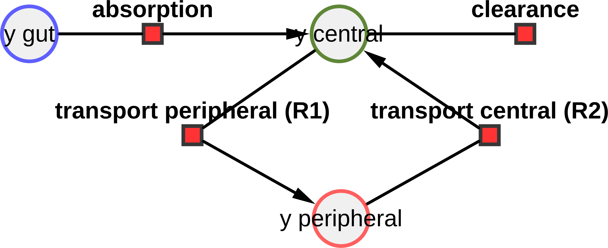
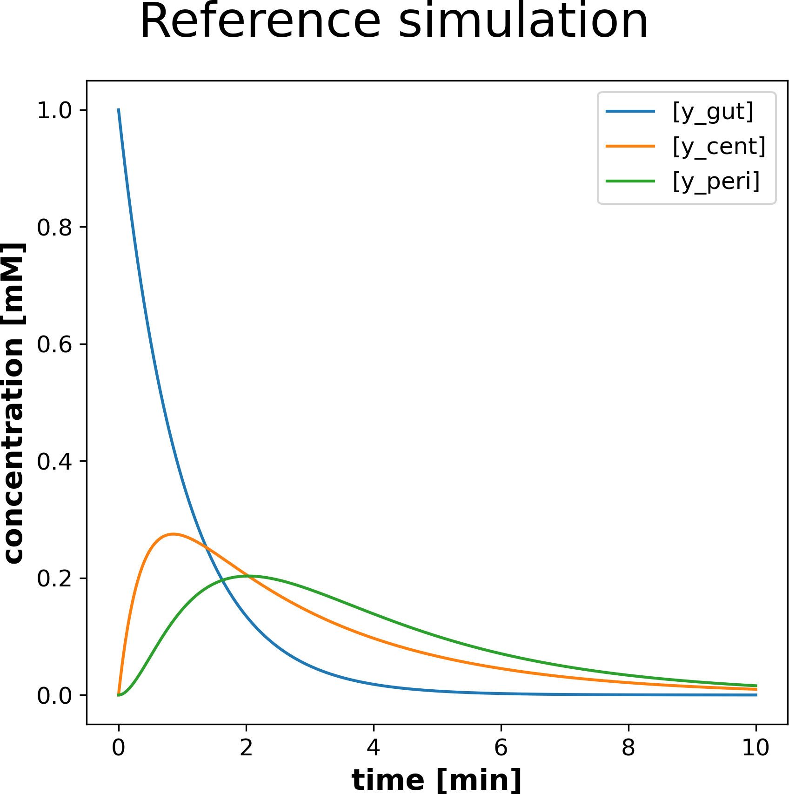
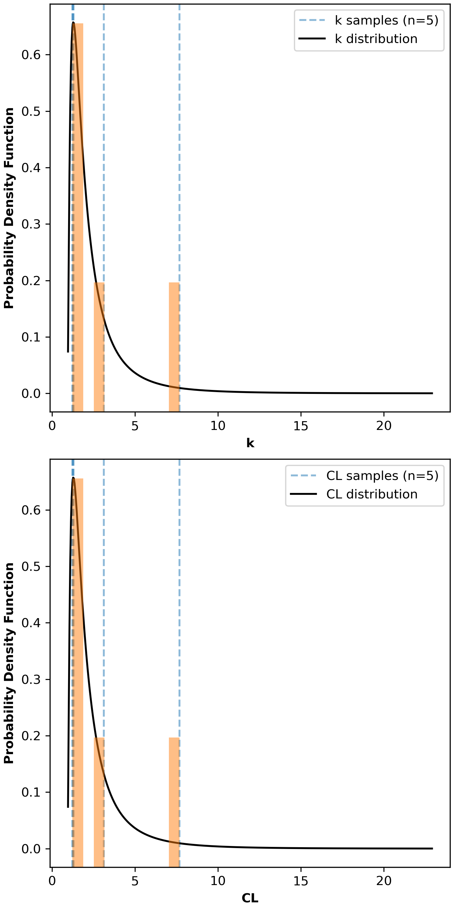
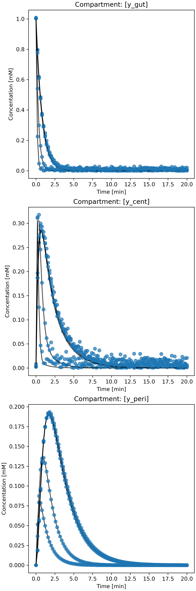
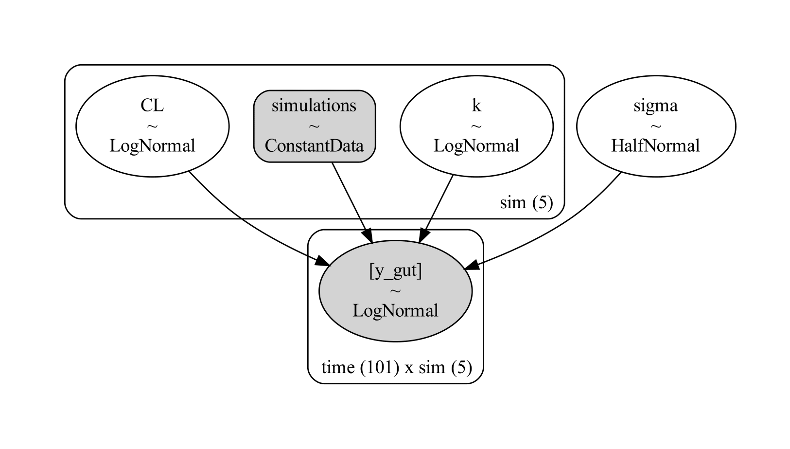
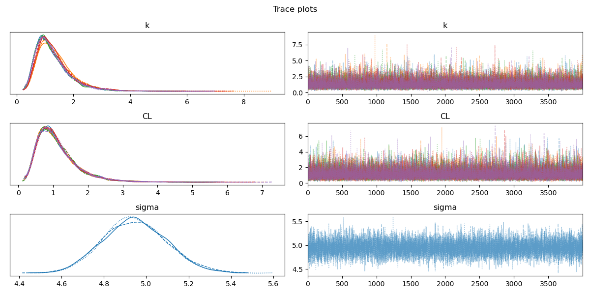
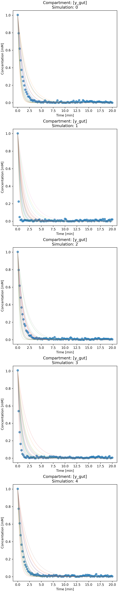

# Bayesian models for ODE models in SBML 

This project implements Bayesian models using [PyMC](https://www.pymc.io) on top of ODE-based models encoded in the [Systems Biology Markup Language](https://sbml.org/) (SBML).

## Motivation

[Systems Biology Markup Language](https://sbml.org/) (SBML) provides an intuitive and reproducible way to define ordinary differential equation (ODE) models in systems biology and systems medicine. Here we outline an attempt to build a Bayesian framework to quantify the uncertainty of estimates associated with physiologically based pharmacokinetic (PBPK) models encoded in SBML.


## Installation

### libraries
Install graphviz library

```bash
sudo apt-get -y install graphviz graphviz-dev
```

### virtual environment
Create a virtual environment and install the dependencies defined in the `requirements.txt`

```bash
mkvirtualenv parameter-variability --python=python3.10
(parameter-variability) pip install -r requirements.txt
```

# Example
## ODE model
As an example PBPK model (see figure below), a simple PK model is implemented consisting of three compartments, `gut`, `central` and `peripheral`. The substance `y` can be transferred from the gut to the central compartment via `absorption`. The substance `y` can be distributed in the peripheral compartment via `R1` or return from the peripheral to the central compartment via `R2`. Substance 'y' is removed from the central compartment by `clearance`.



The SBML of the model is available from 
[simple_pk.xml](./src/parameter_variability/models/sbml/simple_pk.xml).

The resulting ODEs of the model are
```bash
time: [min]
substance: [mmol]
extent: [mmol]
volume: [l]
area: [m^2]
length: [m]

# Parameters `p`
CL = 1.0  # [l/min] 
Q = 1.0  # [l/min] 
Vcent = 1.0  # [l] 
Vgut = 1.0  # [l] 
Vperi = 1.0  # [l] 
k = 1.0  # [l/min] 

# Initial conditions `x0`
y_cent = 0.0  # [mmol/l] Vcent
y_gut = 1.0  # [mmol/l] Vgut
y_peri = 0.0  # [mmol/l] Vperi

# ODE system
# y
ABSORPTION = k * y_gut  # [mmol/min]
CLEARANCE = CL * y_cent  # [mmol/min]
R1 = Q * y_cent  # [mmol/min]
R2 = Q * y_peri  # [mmol/min]

# odes
d y_cent/dt = (ABSORPTION / Vcent - CLEARANCE / Vcent - R1 / Vcent) + R2 / Vcent  # [mmol/l/min]
d y_gut/dt = -ABSORPTION / Vgut  # [mmol/l/min]
d y_peri/dt = R1 / Vperi - R2 / Vperi  # [mmol/l/min]
```

An example output of the model is provided here




## Bayesian model
To generate the toy example, the two-compartment model is fed draws from an idealized random distribution for each parameter. These are called `true_thetas'. 
A forward simulation is then run to generate a run simulation for each theta. 

After adding noise to the simulation(s), a Bayesian model fits the data and draws samples from a posterior distribution. 
The empirical distribution of these samples should contain the `true_thetas'.

Current modelled parameters:
- `k`: Absorption constant
- `CL` Clearance constant

To run the example Bayesian model execute the `bayes_example.py` script

```bash
(parameter-variability) python src/parameter_variability/bayes/bayes_example.py
```

### Outputs

Plots of results for the analysis on the Gut compartment

*Figure 1*: Sampling random parameters from "true" distribution



*Figure 2*: Toy Data simulated using values from the true distribution



*Figure 3*: Graph representing the Bayesian Model



*Figure 4*: Trace Plot of the parameters sampled from the Bayesian model



*Figure 5*: Proposed simulations sampled from the Bayesian Model




# License

* Source Code: [LGPLv3](http://opensource.org/licenses/LGPL-3.0)
* Documentation: [CC BY-SA 4.0](http://creativecommons.org/licenses/by-sa/4.0/)

The parameter-variability source is released under both the GPL and LGPL licenses version 2 or later. You may choose which license you choose to use the software under.

This program is free software: you can redistribute it and/or modify it under
the terms of the GNU General Public License or the GNU Lesser General Public
License as published by the Free Software Foundation, either version 2 of the
License, or (at your option) any later version.

This program is distributed in the hope that it will be useful, but WITHOUT ANY
WARRANTY; without even the implied warranty of MERCHANTABILITY or FITNESS FOR A
PARTICULAR PURPOSE. See the GNU General Public License for more details.


# Funding

Matthias König is supported by the Federal Ministry of Education and Research (BMBF, Germany) within the research network Systems Medicine of the Liver (**LiSyM**, grant number 031L0054) and by the German Research Foundation (DFG) within the Research Unit Programme FOR 5151 [QuaLiPerF](https://qualiperf.de) (Quantifying Liver Perfusion-Function Relationship in Complex Resection - A Systems Medicine Approach)" by grant number 436883643 and by grant number 465194077 (Priority Programme SPP 2311, Subproject SimLivA).

© 2023-2024 Antonio Alvarez and [Matthias König](https://livermetabolism.com)
