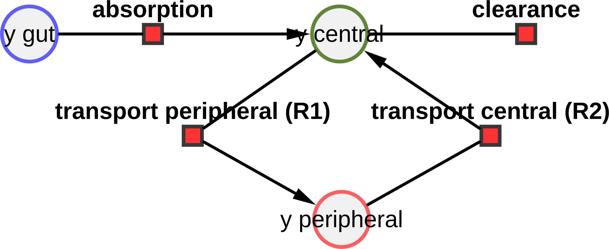

[](https://github.com/matthiaskoenig/parameter-variability/actions/workflows/main.yml)
[](https://opensource.org/licenses/MIT)
[](https://doi.org/https://doi.org/10.5281/zenodo.19695915)

# Bayesian optimization workflow for ODE models in SBML

Within this thesis a reproducible parameter optimization approach applicable to a range of pharmacokinetic (PK) computational models was developed. The worflow was applied to three PK models of increasing complexity, from simple compartmental models to physiologically-based pharmacokinetic (PBPK) models. The influence of key hyperparameters consisting of number of samples, timepoints, coefficient of variation and priors was studied on the three models.

[Systems Biology Markup Language](https://sbml.org/) (SBML) provides an intuitive and reproducible way to define ordinary differential equation (ODE) models in systems biology and systems medicine. Here we outline an attempt to build a Bayesian framework to quantify the uncertainty of estimates associated with physiologically based pharmacokinetic (PBPK) models encoded in SBML.

For documentation see [Bayesian optimization workflow for ODE models in SBML [Alvarez2026]](./docs/Master.Thesis.Antonio.Alvarez.pdf).

## How to cite
To cite the software repository

> Alvarez, A. & König, M. (2026).
> *Bayesian optimization workflow for ODE models in SBML.*
> Zenodo. [https://doi.org/10.5281/zenodo.19695915](https://doi.org/10.5281/zenodo.19695915)

To cite the documentation
> Alvarez, A. (2026).
> *Parameter Uncertainty in the Optimization of Pharmacokinetic Models: A Reproducible Bayesian Approach*

# License
* Source Code: [MIT](https://opensource.org/license/MIT)
* Documentation: [CC BY-SA 4.0](http://creativecommons.org/licenses/by-sa/4.0/)
* Models: [CC BY-SA 4.0](http://creativecommons.org/licenses/by-sa/4.0/)

This program is distributed in the hope that it will be useful, but WITHOUT ANY
WARRANTY; without even the implied warranty of MERCHANTABILITY or FITNESS FOR A
PARTICULAR PURPOSE.

## Installation

### Dependencies
```bash
sudo apt install -y build-essential cmake libhdf5-serial-dev
```

### Running
Create a virtual environment with `uv`(https://docs.astral.sh/uv/getting-started/installation/)

```bash
uv sync
```
### Development
For development setup via the following which installs the development dependencies
and the pre-commit.
```bash
# install core dependencies
uv sync

# install dev dependencies
uv pip install -r pyproject.toml --extra dev
uv tool install tox --with tox-uv

# setup pre-commit
uv pip install pre-commit
pre-commit install
pre-commit run
```

### Testing with tox
Run single tox target
```bash
tox r -e py314
```
Run all tests in parallel
```bash
tox r
```

# Example
## ODE model
As an example PBPK model (see figure below), a simple PK model is implemented consisting of three compartments, `gut`, `central` and `peripheral`. The substance `y` can be transferred from the gut to the central compartment via `absorption`. The substance `y` can be distributed in the peripheral compartment via `R1` or return from the peripheral to the central compartment via `R2`. Substance 'y' is removed from the central compartment by `clearance`.



The SBML of the model is available from
[simple_pk.xml](src/parvar/models/sbml/simple_pk.xml).

The resulting ODEs of the model are
```bash
time: [min]
substance: [mmol]
extent: [mmol]
volume: [l]
area: [m^2]
length: [m]

# Parameters `p`
CL = 1.0  # [l/min]
Q = 1.0  # [l/min]
Vcent = 1.0  # [l]
Vgut = 1.0  # [l]
Vperi = 1.0  # [l]
k = 1.0  # [l/min]

# Initial conditions `x0`
y_cent = 0.0  # [mmol/l] Vcent
y_gut = 1.0  # [mmol/l] Vgut
y_peri = 0.0  # [mmol/l] Vperi

# ODE system
# y
ABSORPTION = k * y_gut  # [mmol/min]
CLEARANCE = CL * y_cent  # [mmol/min]
R1 = Q * y_cent  # [mmol/min]
R2 = Q * y_peri  # [mmol/min]

# odes
d y_cent/dt = (ABSORPTION / Vcent - CLEARANCE / Vcent - R1 / Vcent) + R2 / Vcent  # [mmol/l/min]
d y_gut/dt = -ABSORPTION / Vgut  # [mmol/l/min]
d y_peri/dt = R1 / Vperi - R2 / Vperi  # [mmol/l/min]
```

# Funding
Matthias König is supported by the Federal Ministry of Education and Research (BMBF, Germany) within the research network Systems Medicine of the Liver (**LiSyM**, grant number 031L0054) and by the German Research Foundation (DFG) within the Research Unit Programme FOR 5151 [QuaLiPerF](https://qualiperf.de) (Quantifying Liver Perfusion-Function Relationship in Complex Resection - A Systems Medicine Approach)" by grant number 436883643 and by grant number 465194077 (Priority Programme SPP 2311, Subproject SimLivA).

© 2023-2026 Antonio Alvarez and [Matthias König](https://livermetabolism.com)
